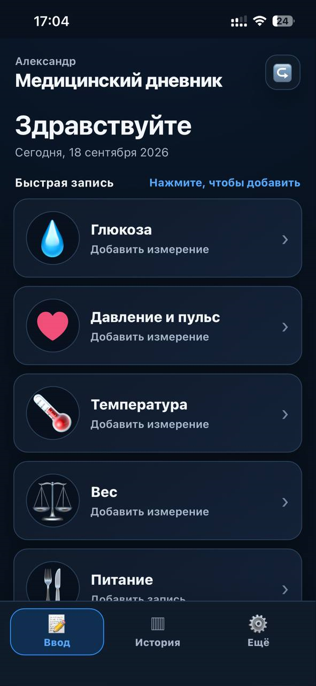
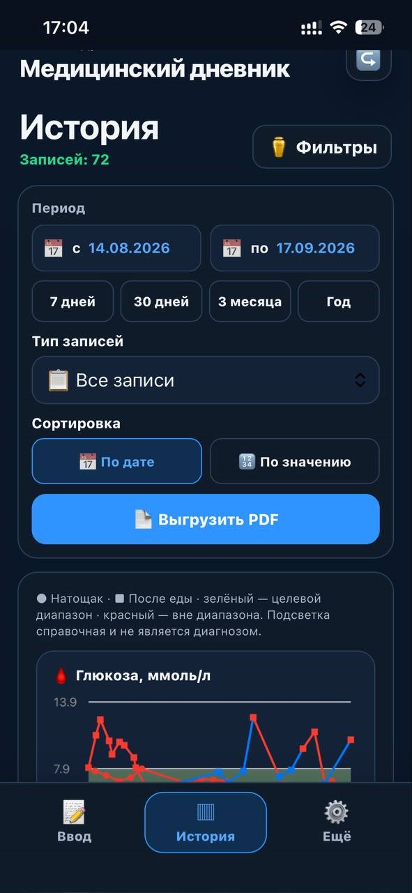
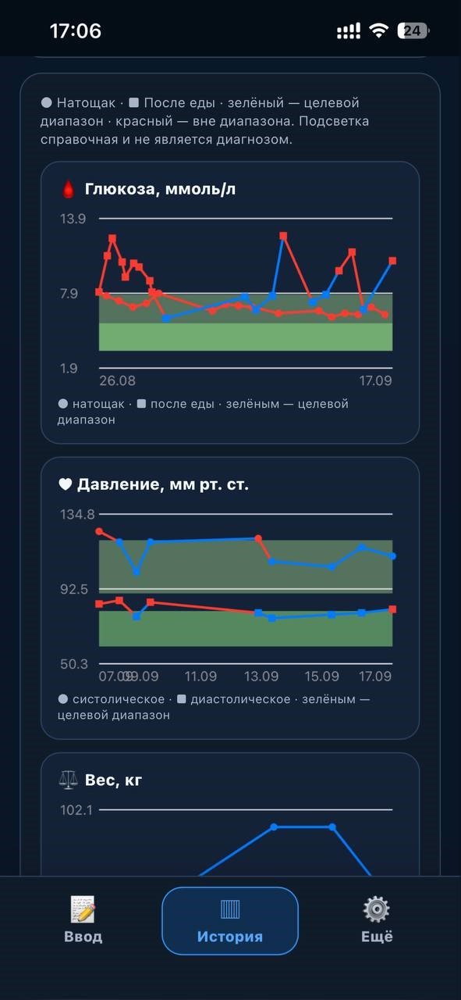
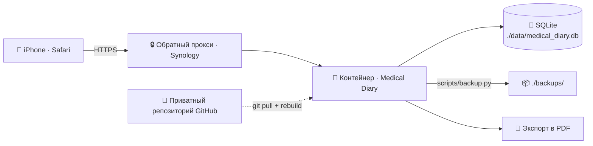

<div align="center">
  
</div>

<div align="center">
  <a href="#архитектура"></a>
  <a href="#архитектура"></a>
  <a href="#архитектура"></a>
  <a href="#безопасность"></a>
  <a href="#скриншоты"></a>
  <a href="#лицензия-и-дисклеймер"></a>
</div>

> [!IMPORTANT]
> 🩺 Medical Diary — инструмент для фиксации наблюдений, а не для медицинских решений.
> Сервис не ставит диагнозы и не назначает лечение. Автоматические оценки и ответы ИИ являются справочными.

---

## 📖 О проекте

Medical Diary v2 — приватный веб-дневник для личного наблюдения за показателями здоровья, спроектированный для быстрого ввода с iPhone в Safari. Несколько раз в день вы за пару касаний фиксируете:

| Показатель | Что записывается |
| --- | --- |
| 🩸 Глюкоза крови | натощак и после еды |
| ❤️ Давление и пульс | систолическое / диастолическое + пульс |
| 🍽 Питание | съеденные продукты с точным количеством |

Каждая запись автоматически сохраняется в базу данных с датой и точным временем.

---

## ✨ Возможности

- ⚡ Быстрый ввод одной рукой — крупные элементы, минимум действий
- 📱 Mobile-first интерфейс — адаптация под iPhone и Safari
- 🔐 Вход по Face ID / Touch ID через WebAuthn
- 🗂 История с фильтрами по датам и типам записей + наглядная общая таблица
- 🚦 Справочная подсветка значений относительно персональных диапазонов
- 📈 Графики динамики глюкозы и давления
- 📄 Экспорт периода в PDF — таблица, удобная для печати и отправки врачу
- 🧽 Мягкое удаление записей — данные не теряются безвозвратно
- 🧾 Аудит всех действий
- 🛡 Защита от перебора паролей
- 💾 Резервное копирование SQLite
- 🐳 Запуск в Docker на Synology NAS

---

## 📸 Скриншоты

| ✍️ Быстрый ввод | 🗂 История и фильтры | 📈 Графики и PDF |
| --- | --- | --- |
|  |  |  |

---

## 🏗 Архитектура



- 🐳 один Docker-контейнер приложения;
- 💾 база данных SQLite внутри контейнера, файл хранится в `./data/medical_diary.db` (постоянный volume);
- 📦 резервные копии — в `./backups/`;
- 🏠 деплой на Synology — `/volume1/docker/medical_diary`;
- 🔏 закрытый GitHub-репозиторий `medical_diary`.

---

## 💊 Интеграция с «Честным знаком» / MDLP

Data Matrix разбирается локально: из кода извлекаются GTIN, серийный номер,
партия и срок годности. Для автозаполнения карточки лекарства используется
локальная копия официальной открытой выгрузки МДЛП.

Запросы к внешнему MDLP API при каждом сканировании и сохранении лекарства
не выполняются. Это делает основной сценарий независимым от доступности
внешнего API и не передаёт маркировку пользователя наружу.

## 🚀 Установка на Synology

### Способ 1: установка одной командой (рекомендуется)

Скрипт `install_synology.sh` выполняет всё сам: скачивает код, генерирует `SECRET_KEY` и пароль администратора, создаёт `.env` с правами `600`, собирает контейнер и проверяет `/health`.

Подключитесь по SSH и запустите от `root`:

```bash
ssh пользователь@IP_СИНОЛОДЖИ
sudo -i
curl -fsSL https://raw.githubusercontent.com/ceshbox-code/medical_diary/main/install_synology.sh | sh
```

Скрипт задаст несколько вопросов:

| Вопрос | Что указать | По умолчанию |
| :--- | :--- | :--- |
| 📁 Папка установки | путь вида `/volume1/docker/...` | `/volume1/docker/medical_diary` |
| 🔌 Внешний порт приложения | порт на NAS (в контейнере всегда `8000`) | `8000` |
| 🐳 Имя Docker-контейнера | уникальное имя контейнера | `medical-diary-app` |
| 🕐 Часовой пояс контейнера | формат IANA, например `Europe/Moscow` | `Europe/Moscow` |
| 🌐 Доменное имя для доступа и WebAuthn | только имя хоста, например `diary.example.ru`, без `https://` и пути. Пусто — если домена нет | пусто (без домена) |
| 🔒 HTTPS reverse proxy | будет ли домен опубликован через HTTPS-реверс-прокси в DSM | `Y` (да) |
| 🤖 ИИ-ассистент GigaChat | включить опциональную интеграцию с GigaChat | `N` (нет) |
| 🔑 GIGACHAT_AUTH_KEY | ключ авторизации GigaChat (можно заполнить позже в `.env`) | пусто |

> [!NOTE]
> Если вы указали домен, скрипт спросит, будет ли он опубликован через HTTPS reverse proxy в DSM. Отвечайте «да»: **`SESSION_COOKIE_SECURE` и WebAuthn требуют именно такую схему**.

> [!IMPORTANT]
> Ключ `GIGACHAT_AUTH_KEY` можно оставить пустым при установке и заполнить позже в файле `.env`. Подробнее о настройке GigaChat — в разделе [🤖 Настройка ИИ: GigaChat](#-настройка-ии-гигачат-бесплатный-доступ).

Что делает скрипт автоматически:

- ✅ проверяет запуск от `root`, наличие `openssl`, `curl` и Docker;
- 📥 скачивает код (через `git`, если папка уже репозиторий, иначе архивом с GitHub);
- 📁 создаёт `data/` и `backups/` с правами `700`;
- 🔐 генерирует `SECRET_KEY` и пароль администратора (20+ символов) и показывает пароль один раз;
- 🌐 настраивает `SESSION_COOKIE_SECURE`, `WA_RP_ID` и `WA_ORIGIN` в зависимости от домена;
- 🐳 собирает контейнер и ждёт `/health` до 120 секунд.

Повторный запуск скрипта обновляет код, но сохраняет `.env`, `data/` и `backups/` — его безопасно запускать как для обновления, так и для восстановления.

Переменные окружения задают значения по умолчанию для ответов (скрипт всё равно подтверждает их в терминале):

| Переменная | Назначение |
| --- | --- |
| `MEDICAL_DIARY_DIR` | Папка установки |
| `MEDICAL_DIARY_HTTP_PORT` | Внешний порт |
| `MEDICAL_DIARY_DOMAIN` | Домен для доступа и WebAuthn |
| `MEDICAL_DIARY_BRANCH` | Ветка репозитория (по умолчанию `main`) |

> [!WARNING]
> 🔑 Пароль администратора выводится один раз в конце установки и сохраняется в файле `.env` с правами `600`.
>
> Первоначальный пароль можно найти в `.env` в переменной `ADMIN_PASSWORD`, если он не менялся позже в панели администратора. Например:
>
> ```bash
> cd /volume1/docker/medical_diary
> sudo grep '^ADMIN_PASSWORD=' .env
> ```
>
> Если пароль менялся в веб-интерфейсе или значение в `.env` недоступно, используйте восстановление:
>
> ```bash
> ./scripts/reset_admin_password.sh --ask
> ```
>
> Не публикуйте содержимое `.env` и не коммитьте этот файл в Git.

> [!IMPORTANT]
> 🩺 Если скрипт не смог проверить `/health`, он выведет статус контейнера и последние логи. Посмотрите их вручную:
>
> ```bash
> cd /volume1/docker/medical_diary && docker compose logs -f
> ```

---

### Способ 2: ручная установка

#### 0️⃣ Требования

- Synology NAS с поддержкой Docker (пакет Container Manager / Docker);
- DSM 7.x, включённый SSH (Панель управления → Терминал и SNMP);
- приватный репозиторий `medical_diary` и доступ к нему (токен или SSH-ключ).

#### 1️⃣ Подключитесь и создайте каталог

```bash
ssh пользователь@IP_СИНОЛОДЖИ
sudo mkdir -p /volume1/docker/medical_diary
cd /volume1/docker/medical_diary
```

#### 2️⃣ Скачайте код

```bash
sudo git clone https://github.com/ceshbox-code/medical_diary.git .
```

#### 3️⃣ Настройте окружение

```bash
cp .env.example .env
nano .env
```

Сгенерируйте секретный ключ:

```bash
openssl rand -hex 32
```

Задайте в `.env` как минимум `SECRET_KEY`, `ADMIN_USERNAME` и `ADMIN_PASSWORD`.

> [!WARNING]
> 🔑 `ADMIN_PASSWORD` применяется только один раз — при первой инициализации пустой БД.
> На уже работающей установке правка `.env` пароль не меняет.

#### 4️⃣ Запустите

```bash
docker compose up -d --build
```

Проверка:

```bash
curl http://127.0.0.1:8000/health
```

#### 5️⃣ Включите HTTPS (обязательно для Face ID / Touch ID)

WebAuthn работает только по HTTPS. Создайте обратный прокси:

**Панель управления → Портал входа → Дополнительно → Обратный прокси**

Источником укажите:

```text
https://diary.ваш-домен
```

Назначением укажите:

```text
http://localhost:8000
```

Затем допишите в `.env`:

```env
SESSION_COOKIE_SECURE=true
WA_RP_ID=diary.ваш-домен
WA_ORIGIN=https://diary.ваш-домен
```

Примените изменения:

```bash
docker compose up -d
```

#### 6️⃣ Первый вход

1. Откройте сервис по HTTPS-адресу и войдите с `ADMIN_USERNAME` / `ADMIN_PASSWORD`.
2. Смените пароль в панели администратора.
3. Зарегистрируйте Face ID / Touch ID (WebAuthn) для входа в одно касание.

#### 7️⃣ Настройте автобэкапы (рекомендуется)

**Плановщик задач → Создать → По расписанию → пользовательский скрипт**

Например, ежедневно в 03:00:

```bash
docker exec medical-diary python3 scripts/backup.py
```

Дополнительно копируйте `./backups/` за пределы NAS в зашифрованном виде.

---

## ⚙️ Переменные окружения

| Переменная | Назначение |
| --- | --- |
| `DATABASE_PATH` | Путь к SQLite внутри контейнера |
| `SECRET_KEY` | Секретный ключ сессий (обязательно) |
| `SESSION_COOKIE_SECURE` | Требовать HTTPS для cookie |
| `ADMIN_USERNAME` | Логин первого администратора |
| `ADMIN_PASSWORD` | Пароль первого администратора |
| `WA_RP_ID` | Домен для WebAuthn |
| `WA_ORIGIN` | HTTPS-origin для WebAuthn |
| `FONT_PATH` | Путь к шрифту для кириллицы в PDF |
| `HTTP_PORT` | Внешний порт приложения (для скрипта установки) |
| `TZ` | Часовой пояс контейнера |
| `GIGACHAT_ENABLED` | Включает/выключает ИИ-функции (опционально) |
| `GIGACHAT_API_KEY` | Секретный ключ доступа к GigaChat (опционально) |
| `GIGACHAT_MODEL` | Модель GigaChat, если интеграция поддерживает выбор модели |
| `GIGACHAT_TIMEOUT` | Таймаут запросов к внешнему ИИ-сервису, сек. |

---

## 🤖 Настройка ИИ: GigaChat (бесплатный доступ)

> [!IMPORTANT]
> ИИ-ответы являются справочными и не заменяют консультацию врача. Сервис не ставит диагнозы и не назначает лечение.

Поддержка ИИ подключается опционально через GigaChat. Если ключи не заданы или `GIGACHAT_ENABLED=false`, сервис должен продолжать работать без ИИ-функций.

### 1. Получите доступ к GigaChat

1. Зарегистрируйтесь в кабинете разработчика GigaChat.
2. Создайте проект или приложение для доступа к API.
3. Получите ключ доступа или данные авторизации.
4. Если вам доступен бесплатный тариф или пробный период, убедитесь, что лимиты и условия использования подходят для личного применения.

> [!NOTE]
> Бесплатный доступ, лимиты и доступные модели предоставляются на стороне сервиса GigaChat и могут изменяться. Если ключ не принимается, проверьте статус доступа в кабинете разработчика.

### 2. Добавьте ключ в `.env`

Подключитесь к Synology по SSH и откройте папку проекта:

```bash
cd /volume1/docker/medical_diary
nano .env
```

Добавьте в конец файла параметры интеграции:

```env
# --- GigaChat AI (опционально) ---
# Включить ИИ-функции
GIGACHAT_ENABLED=true

# Секретный ключ доступа к GigaChat
GIGACHAT_API_KEY=ВСТАВЬТЕ_ПОЛУЧЕННЫЙ_КЛЮЧ

# Необязательные параметры
# Модель ИИ, если поддерживается интеграцией
# GIGACHAT_MODEL=GigaChat

# Таймаут запроса к внешнему ИИ-сервису, сек.
# GIGACHAT_TIMEOUT=30
```

Сохраните файл.

### 3. Примените изменения

Перезапустите контейнер, чтобы приложение подхватило новые переменные:

```bash
docker compose up -d
```

Проверьте состояние сервиса:

```bash
mdctl health
mdctl logs
```

Если интеграция активна и ключ корректен, ИИ-функции станут доступны в интерфейсе.

### 4. Отключение ИИ

Если нужно временно или полностью отключить ИИ, установите:

```env
GIGACHAT_ENABLED=false
```

или удалите блок переменных GigaChat из `.env`, затем выполните:

```bash
docker compose up -d
```

### Безопасность при использовании внешнего ИИ

> [!WARNING]
> GigaChat является внешним сервисом. Перед включением ИИ убедитесь, что вы понимаете и принимаете условия обработки данных внешним провайдером.

Рекомендации:

- не передавайте в ИИ ФИО, даты рождения, контакты, адреса и другие идентифицирующие данные;
- по возможности передавайте только обезличенные показатели и общие вопросы;
- храните `GIGACHAT_API_KEY` только в `.env`;
- файл `.env` должен иметь права `600`;
- не коммитьте `.env` в Git;
- при утечке ключа немедленно отзовите его и создайте новый в кабинете GigaChat;
- ИИ-ответы должны использоваться только как справочная информация, а не как медицинская рекомендация.

---

## 🧰 Шпаргалка владельца

Скрипт установки копирует утилиту `mdctl` в `/usr/local/bin/`, поэтому команды работают из любой папки и автоматически находят папку проекта и контейнер, даже если вы установили проект не в `/volume1/docker/medical_diary` или задали нестандартное имя контейнера.

| Задача | Команда |
| --- | --- |
| ✅ Проверка здоровья сервиса | `mdctl health` |
| 📊 Статус контейнера | `mdctl status` |
| 💾 Резервная копия | `mdctl backup` |
| 🪵 Логи | `mdctl logs` |
| 🪵 Логи в реальном времени | `mdctl logs -f` |
| 🔄 Обновление | `mdctl update` |
| 🔑 Сброс пароля админа | `mdctl reset-password` |
| 🐚 Оболочка контейнера | `mdctl shell` |
| 💾 Открыть базу данных | `mdctl db` |
| 📄 Показать конфигурацию | `mdctl env` |
| 📁 Показать папку проекта | `mdctl path` |

Если проект установлен в нестандартную папку, задайте её один раз:

```bash
export MEDICAL_DIARY_HOME=/volume2/docker/my_diary
```

---


## 💊 Локальный справочник лекарственных средств

Справочник МДЛП хранится в отдельной SQLite БД, не смешанной с медицинской
БД пользователя. В текущей выгрузке 74 445 строк и 74 445 уникальных GTIN,
поэтому GTIN используется как первичный ключ.

Основной поток:

`Data Matrix → пользовательское исправление GTIN → mdlp_gtins → ручной ввод`

В таблице `mdlp_gtins` сохраняются исходные поля CSV без потери информации:
`prod_name`, `prod_desc`, `prod_sell_name`, `reg_id`, `reg_holder`,
`prod_d_name`, `prod_form_name`, `prod_pack_1_desc`, признаки ЖНВЛП,
наркотических веществ и другие поля источника.

Важно: в приложении поле `inn` используется как историческое имя поля МНН для
совместимости с существующей моделью данных. Поле `inn` из исходной CSV-выгрузки
как ИНН организации в пользовательский API и карточку лекарства не переносится.

Пользовательские исправления сохраняются отдельно в `medication_barcodes`
с привязкой к пользователю и GTIN и имеют приоритет над публичной выгрузкой.
Данные публичного справочника не перезаписывают уже сохранённые медицинские
данные.

### Обновление справочника

Отдельный контейнер `mdlp-updater` обновляет справочник раз в неделю
(по умолчанию 604800 секунд) из настроенного CSV URL Датамаркета. Для автоматического
перехода на новую публикацию необходимо обновить `MDLP_EXPORT_URL`; приложение
намеренно не угадывает URL новой выгрузки.
Импорт транзакционный: при ошибке старая версия справочника остаётся целой.

Путь справочника задаётся переменной `MDLP_REFERENCE_DB`; в Docker Compose
это отдельный volume `./mdlp_reference_data:/reference`. Контейнер updater
не получает доступ к `./data/medical_diary.db`.

При необходимости источник можно переопределить:

```env
MDLP_EXPORT_URL=<прямая ссылка на нужную CSV-выгрузку>
MDLP_UPDATE_INTERVAL_SECONDS=604800
```

API:

```http
GET /api/drug/by-gtin/{gtin}
```

## 🔐 Безопасность

- `.env` **не коммитится**; секреты хранятся только в `.env`;
- 🗄 данные и бэкапы **не публикуются в Git**;
- 🔏 используйте **приватный репозиторий**;
- 🔒 рекомендуется закрыть сервис **обратным прокси с HTTPS** (+ `SESSION_COOKIE_SECURE=true`);
- 🛡 защита от перебора паролей и **аудит всех действий**;
- 🧾 храните `.env` и базу данных в надёжном месте;
- 💾 регулярно делайте **зашифрованные бэкапы**;
- 🚫 не публикуйте медицинские данные;
- 🔐 скрипт установки создаёт `.env` с правами `600`, а `data/` и `backups/` — с правами `700`.

---

## 🔑 Восстановление доступа администратора

- `ADMIN_PASSWORD` в `.env` применяется только один раз, при первой инициализации пустой БД;
- сменить пароль, будучи залогиненным, можно в **панели администратора**;
- если доступ потерян:

```bash
./scripts/reset_admin_password.sh --ask
```

Контейнер останавливать не нужно.

Либо:

```bash
docker exec --env-file .env medical-diary python3 scripts/reset_admin_password.py
```

Подробности и флаги:

```bash
reset_admin_password.py --help
```

---

## 💾 Резервное копирование и восстановление

Создание резервной копии:

```bash
docker exec medical-diary python3 scripts/backup.py
```

Копии складываются в `./backups/` (постоянный volume).

Для восстановления:

1. Остановите контейнер.
2. Замените `./data/medical_diary.db` файлом из копии.
3. Запустите контейнер снова.

---

## 🆕 Что нового во v2

| Было (v1) | Стало (v2) |
| --- | --- |
| Вход по паролю | ➕ WebAuthn: Face ID / Touch ID |
| Таблица и история | ➕ графики динамики глюкозы и давления |
| Ручная оценка значений | ➕ справочная подсветка персональных диапазонов |
| Обычное удаление | ➕ мягкое удаление + аудит всех действий |
| Базовая защита | ➕ защита от перебора паролей |
| Ручная установка | ➕ установка одной командой через `install_synology.sh` |

---

## ⚠️ Лицензия и дисклеймер

Сервис хранит данные пользователя и не ставит диагнозы.

Медицинские данные вводятся пользователем вручную.

Приложение не назначает лечение; автоматические оценки — справочные.

Лицензия: приватный проект для личного использования.

<div align="center">
  
</div>
